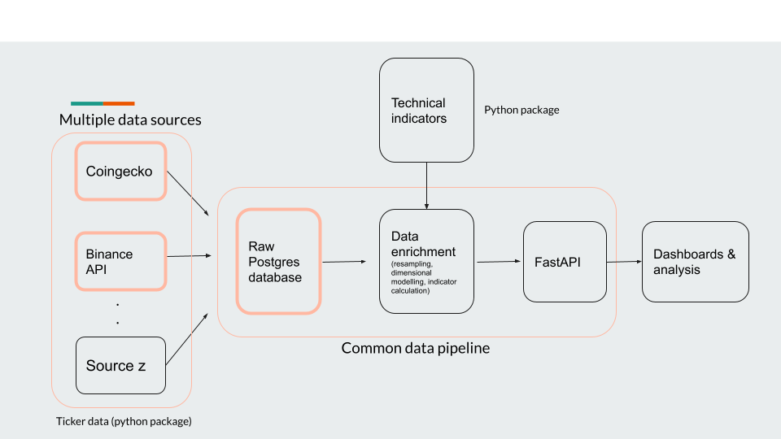
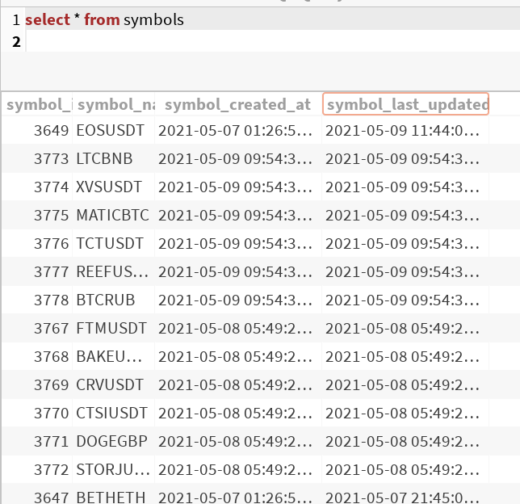
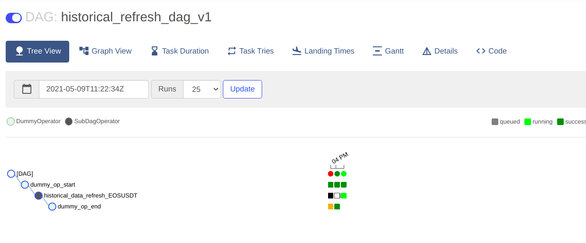
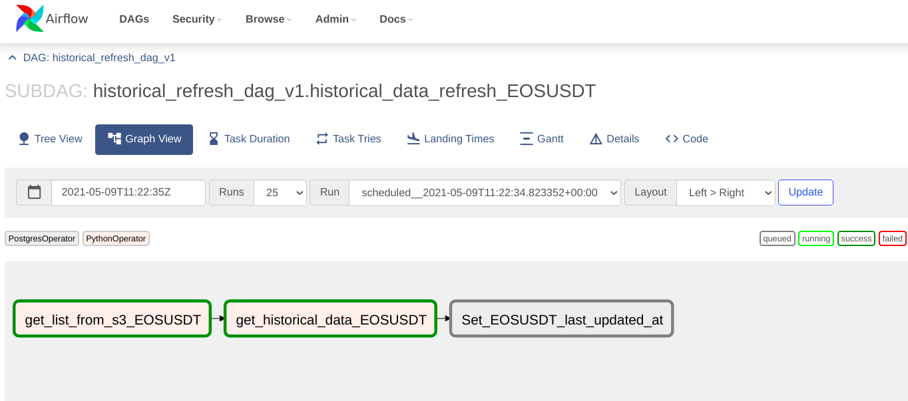

Internals
=========

Architecture
------------

The project can be separated into 3 python packages:

1.  trading-alerts (current package) - this will contain the data pipeline package
which will be fledged to collect and enrich the data. Include trading indicator calculation.

2. technical-indicators - all Python methods which calculate indicators
including the ones outline in the introduction section will be housed here.

3. `tickerdata`_ - this will hold wrappers around APIs used for external
data access. For example: with regards to crypto currency data - Binance & CoinGecko APIs
will be housed within this package.

Execution model of data pipeline
--------------------------------

The first dag that is run is the `get_symbols` DAG which pulls the top 100
cryptocurrency symbols by market cap from the coingecko API.

This table is updated daily (for now), and helps to capture a daily change
in overall investment interest. If a crypto currency suddenly gains public interest
it will improve by market cap and if it ranks within the top 100, I'd be interested.

The `last_updated_at` column and minutely data stored in `tickerdata_1m` table
is used to calculate whether historical/incremental DAG should be run for the symbol.

The historical DAG runs a SQL command to find symbols which are listed in the
`symbol` table but do not have any rows where `tickerdata_1m.close_time` is within
the last month. It then hits the Binance S3 buckets to get monthly zip files of 1m ticker
data for each symbol and use our custom Postgres hook to write to the table.
The last thing that the DAG will do is update the `last_updated_at` column in the `symbol`
table.

The incremental DAG will look at the `last_updated_at` column and calculate the number of
Binance API requests that will be required to get data starting from `last_updated_at` timestamp
to current timestamp. It then batches the jobs and creates a Pandas dataframe which will then be
written to database. Again, the incremental DAG will update the `last_updated_at` column as well.

All timestamps in data processing are in UTC timezone.

Dynamic dags
------------

Dynamic graphs are useful when your pipeline depends on varying number of
inputs which cannot be fixed while designing the pipeline. For example - a
sensor that monitors for a new key in a S3 bucket and hands of the processing
to a new DAG once it finds that new file  has been created.

Airflow provides a way to launch dynamic graphs via 3 operators -
TriggerDagRunOperator,  SubDagOperator, ExternalSensor operator. I chose to
create dynamic graphs using the SubDagOperator because of the following
reasons:

The SubDagOperator creates a hierarchial relationship between parent and
child-dags and makes them available on UI via a drill down feature. So this
not only allows you to glance at the parent dag status but also lets you
"zoom-in" into the status of children dags if you want to. Not only this, but
to use SubDagOperator you need a dag factory (a function or a file, which when
executed returns a independent DAG) - this sort of brings it together  for me.

TriggerDagRunOperator is ideal when you want to run a DAG independent of
parent DAG once a condition is met and state history should be shared between
the dags. These dags are not grouped under a single view in the UI.

The other alternative is ExternalSensor. It is a special operator whose function
is to keep polling for a condition till its met or if it times out. These tend to
occupy a worker till the conditoin turns true or operator times out.

So keeping all these things in mind, it was a better alternative to use SubDagOperator
than the other two.

Using SubDagOperator a parent DAG can create sub-dag to create historical data extraction DAGs
for each coin. These are currently chained as I am operating in a laptop but could be run in parallel
using a CeleryExecutor to reduce delays.

The above is a historical refresh for a coinpair taking place.
Each sub DAG can be zoomed into the UI to see the progression of tasks within
as shown below -

Below are screenshots of the data pull logs from the Sub-Dag:

.. image:: images/sub-dag-progress.png
  :width: 800
  :alt: Sub DAG logs

Tickerdata package
------------------

Structurally, this package will contain a separate Python file for each data source
it incorporates and all common functionality will exist modularised in a separate file.

In the `cryptocurrency` sub-module, two classes exist which provide different type of
data - `BinanceAPI` and `CoingeckoAPI`. The former's structure is highlighted here.

.. code-block:: python

	class BinanceAPI():
	    def __init__(self):
	        pass

	    def get_historical(self, symbol, start_ts=None, end_ts=None, granularity='1m'):
	       	pass

This class once instantiated will help get data between a start and end timestamp.

Similarly, a separate sub-module will be added for each of the NYSE and Shanghai stock exchanges.

Progress
--------

Future versions of this package will include DAGs for dimensional modelling and indicator calculations.
And, also a FastAPI rest interface to easily build dashboards from.

.. _tickerdata: https://github.com/kai490952010/tickerdata/tree/dev
